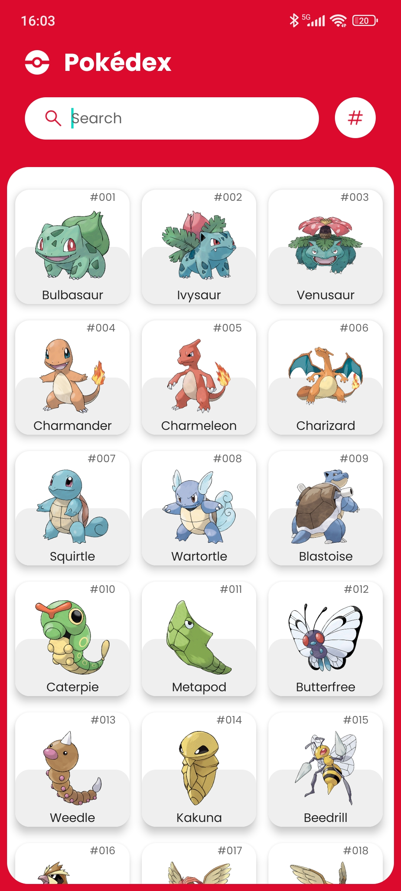

# Integrantes - RM :

- Augusto Barcelos Barros - 98078
- Gabriel Souza de Queiroz - 98570
- Gabriela Zanotto Rodrigues - 551629
- Lucas Pinheiro de Melo - 97707
- Mel Maia Rodrigues - 98266

## Preview do Projeto (Folder Preview)

<video width="375" height="833" controls>
    <source src="./preview/Video.mp4" type="video/mp4">
    Your browser does not support the video tag.
</video>
<picture>
    <source srcset="./preview/Home.jpg" width="375" height="833" alt="Home" style="width:auto;">
    
</picture>
<picture>
    <source srcset="./preview/DetalhesMewtwo.jpg" width="375" height="833" alt="Details" style="width:auto;">
    
</picture>
<picture>
    <source srcset="./preview/DetalhesPsyduck.jpg" width="375" height="833" alt="Search" style="width:auto;">
    
</picture>

## Protótipo de referência

[Figma do Design](https://www.figma.com/community/file/979132880663340794)

> Créditos pelo protótipo [Ricardo Schiniegoski](https://www.figma.com/@ricardohs)

## Descrição do projeto

O projeto consiste em uma aplicação mobile que simula uma Pokedex, onde o usuário pode visualizar informações sobre os Pokémons, como nome, tipo, habilidades, entre outras. A aplicação consomiu a API [PokeAPI](https://pokeapi.co/), que fornece informações sobre os Pokémons, porém está salva em um banco de dados local, para que o usuário possa acessar as informações mesmo sem conexão com a internet.

## Funcionalidades

- [x] Pokemon Aleatório ao clicar na logo (pokebola) no canto superior esquerdo
- [x] Listagem de Pokémons
- [x] Visualização de detalhes de um Pokémon
- [x] Busca de Pokémons
- [ ] Ordenar por nome ou id (TODO: Problemas de otimização ao ordenar)
